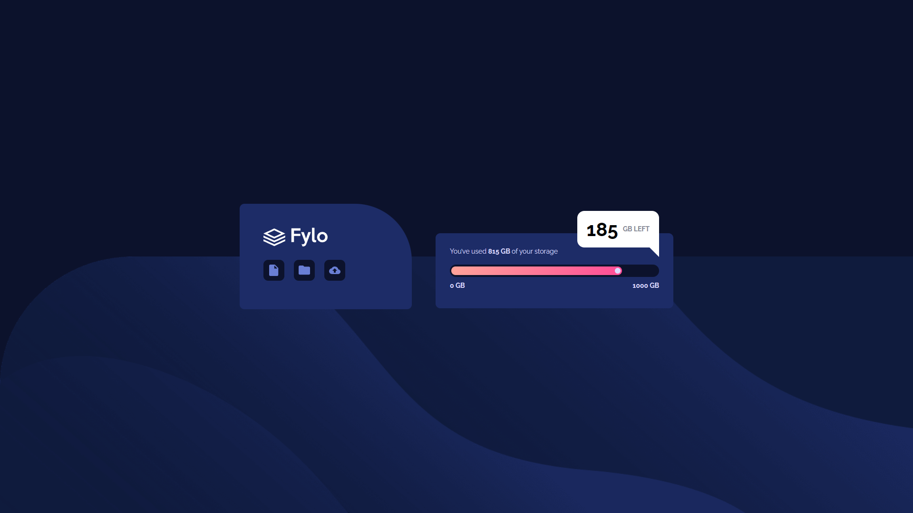
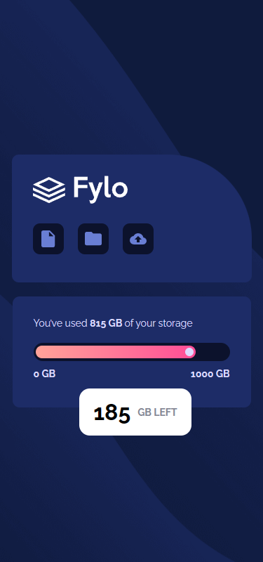

# Frontend Mentor - Fylo data storage component solution

This is a solution to the [Fylo data storage component challenge on Frontend Mentor](https://www.frontendmentor.io/challenges/fylo-data-storage-component-1dZPRbV5n). Frontend Mentor challenges help you improve your coding skills by building realistic projects. 

## Overview

### The challenge

Users should be able to:

- View the optimal layout for the site depending on their device's screen size

#### Desktop Screenshot 🖥️

#### Mobile Screenshot 📱

### link 🔗

- Live Site URL: https://lkiryu.github.io/fylo-data-storage-component/

### Built with 🛠️

- HTML5
- CSS
- JS
---
### Author 👨‍💻
 Made by Matheus Antonio